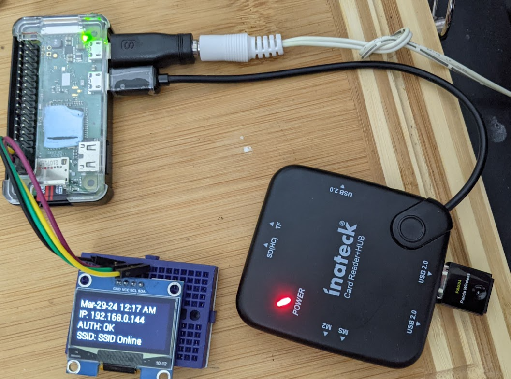

# WPA2-Enterprise-Bridge
Raspberry Pi WPA2-Enterprise microcontroller "Bridge" 

# Why? 

1 - Esp32s and Raspberry pi picos cannot access networks with WPA-Enterprise authentication.

2 - Wifi "Monitor" on your desk. As an Authentication SRE, I find it a nice ice breaker, talking point:




# Requirements
- A raspbery pi or some sort
- A second USB [wireless adapter](https://www.amazon.com/gp/product/B07C9TYDR4) - I used a Panda
- Possibly a USB OTG hub
- Proper power for the Pi - I use a 1.5A 5V unit  with a barrel plug adapter (for easy release / attach)
- Optional - [OLED](https://www.amazon.com/gp/product/B08KY21SR2/) - I used 0.96" OLED on a tiny breadboard

| Cautionary Notes | Description                                             |
|-----------------|---------------------------------------------------------|
| 1. | May need to use a low security workaround for ssl ciphers| 
| 2. | Your password is in clear text protected  by unix permissions (unless your pi is stolen)|
| 3. | Your Network Admin may not like this|

| Other Notes | Description                                             |
| 1. | This works Rasberry Pi OS Version "10 (buster)" (Bookworm in the future) |
| 2. | Expecation is the microcontroller is capable of 2.4 GHZ only|
| 3. | There is no actual network bridging happening per se, it's just a fancy term I use |


- NOTE1: This works Rasberry Pi OS Version "10 (buster)" (Bookwork in the future)
- NOTE2: Steps may need to use a low security workaround at the moment - I am just playing around in a lab env. Use Caution.
- NOTE3: Your password is held in the clear in a text file protected only by unix permissions (which is nothing if your pi is stolen)
- NOTE4: The expecation is the microcontroller / wifi supplicant on wlan1 will be capable of 2.4 GHZ only.
- NOTE5: Your Network Admin may not like this - I am just playing around in a lab env. Use Caution.
- NOTE6: "Bridge" is just a term - there is no actual network or ethernet bridging actually happening per se

With all that out of the way...

# How To
1. Install Buster per usual
2. Install Hostapd
3. Install Dnsmasq
4. Setup your config files like this or similar:


```
1 - /etc/wpa_supplicant/wpa_supplicant.conf

country=US
ctrl_interface=/var/run/wpa_supplicant
ap_scan=1
update_config=1
### Not Secure or wise for Production 
#tls_disable_tlsv1_0=0
#tls_disable_tlsv1_1=0
#openssl_ciphers=DEFAULT@SECLEVEL=0

network={

    ssid="YOURSID"
    key_mgmt=WPA-EAP
    eap=PEAP
    identity="YOURID"

}


cred={

    password="YOURPASS"
    domain="DNS_SUBJECT_NAME_IN_THE_RADIUS_SERVERS_CERT"
    phase2="auth=MSCHAPV2"

}

2 - /etc/systemd/system/multi-user.target.wants/wpa_supplicant.service  (this should be the same, provided for convenience)

[Unit]
Description=WPA supplicant
Before=network.target
After=dbus.service
Wants=network.target

[Service]
Type=dbus
BusName=fi.w1.wpa_supplicant1
ExecStart=/sbin/wpa_supplicant -u -s -O /run/wpa_supplicant

[Install]
WantedBy=multi-user.target
Alias=dbus-fi.w1.wpa_supplicant1.service


3 - /etc/dnsmasq.conf 

# Set the interface to listen on
interface=wlan1

# Specify the range of IP addresses to lease
dhcp-range=192.168.1.175,192.168.1.177,12h

# Set the default gateway
dhcp-option=3,192.168.1.100

# Set the DNS server(s)
dhcp-option=6,8.8.8.8,8.8.4.4

# Set the domain name
domain=lan

# Set the local hostname
expand-hosts

# Log DHCP requests
log-dhcp

# Log to syslog
log-facility=/var/log/dnsmasq.log


4 - /etc/systemd/system/multi-user.target.wants/hostapd.service 
[Unit]
Description=Advanced IEEE 802.11 AP and IEEE 802.1X/WPA/WPA2/EAP Authenticator
After=network.target

[Service]
Type=forking
PIDFile=/run/hostapd.pid
Restart=on-failure
RestartSec=2
Environment=DAEMON_CONF=/etc/hostapd/hostapd_24.conf
EnvironmentFile=-/etc/default/hostapd
ExecStart=/usr/sbin/hostapd  -B -t -f /var/log/hostapd.log ${DAEMON_CONF}
ExecStartPre=/bin/sleep 30 

[Install]
WantedBy=multi-user.target
#!/bin/bash


5 - /etc/hostapd/hostapd_24.conf

interface=wlan1
driver=nl80211
ssid=SOMESSID
hw_mode=g
channel=6
ieee80211n=1
wmm_enabled=1
ht_capab=[HT40+]
auth_algs=1
wpa=2
wpa_passphrase=SOMEPASSPHRASE
wpa_key_mgmt=WPA-PSK
wpa_pairwise=TKIP
rsn_pairwise=CCMP

6 - /etc/dhcpcd.conf

hostname
persistent
option rapid_commit
option domain_name_servers, domain_name, domain_search, host_name
option classless_static_routes
option interface_mtu
require dhcp_server_identifier
slaac private

interface wlan0
    dhcp
#This makes dhcpcd setup the interface but not run any wpa_supplicant hooks for wlan1, allowing the interface to get into AP mode 
#Further we will used the gateway of the interface using WPA-Enterprise
interface wlan1
    static ip_address=192.168.1.100/24
    static routers=192.168.1.100
    static domain_name_servers=8.8.8.8 8.8.4.4
    nohook wpa_supplicant
    nogateway

7 - Make the Pi Route packets 
sysctl net.ipv4.ip_forward=1

8 - /etc/systemd/system/pi_screen_start.service 
[Unit]
Description=Pi Display OLED
After=network-online.target
Wants=network-online.target

[Service]
Type=simple
ExecStart=/root/pi_screen_start.sh

[Install]
WantedBy=multi-user.target

9 - /root/pi_screen_start.sh 
#!/bin/bash
/usr/bin/python3 /root/disp_rad.py

10 - disp_rad.py
See in this repo

```

5. Reboot

With that you should have:
- A functioning client wifi connection on WPA2-Enterprise on wlan0
- A functioning AP wifi connection on wlan1 that routes packets for the client

6. Point your Microcontroller to your Pi as if it were an AP with a basic WPA2 passphrase (because now it is)

# References

[Pi Forum solution for Hostapd Startup Failures](https://forums.raspberrypi.com/viewtopic.php?t=234145)

[Connection Bug lowering Security Levels](https://bugs.launchpad.net/ubuntu/+source/wpa/+bug/1958267)


