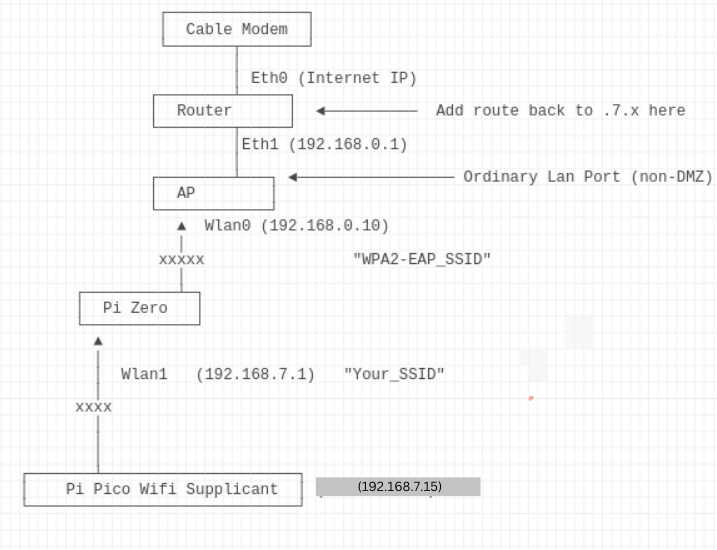

# WPA2-Enterprise-Bridge
Raspberry Pi WPA2-Enterprise microcontroller "Bridge" 

# Why? 

1 - Esp32s and Raspberry pi picos cannot access networks with WPA-Enterprise authentication.

2 - Wifi "Monitor" on your desk. As an SRE/Staff Engineer, I find it a nice ice breaker, talking point:

3a - Older Raspberry Pi versions were not straight forward, requiring lots of troubleshooting and research.

3b - Bookworm was a breeze - Kudos to the references - I am summarizing the commands here.


# Upfront

| Requirements |
|-----------------|
|A raspbery pi of some sort - I used a pi zero w|
|A second USB [wireless adapter](https://www.amazon.com/gp/product/B07C9TYDR4) - I used a Panda as "wlan0" for the AP|
|Possibly a USB OTG hub|
|Proper power for the Pi - I use a 1.5A 5V unit with a barrel plug adapter (for easy release / attach)|
|Optional - [OLED](https://www.amazon.com/gp/product/B08KY21SR2/) - I used 0.96" OLED on a tiny breadboard|

| Cautionary Notes | Description                                             |
|-----------------|---------------------------------------------------------|
| 1. | Possible low security workaround for ssl/eap interoperability - see Rerferences| 
| 2. | Your password is in clear text protected  by unix permissions (and not even that if your pi is stolen)|
| 3. | Your Network Admin may not like this - I am just playing around using a LAB - use caution!|

| Other Notes | Description                                             |
|-----------------|---------------------------------------------------------|
| 1. | Expecation is the microcontroller is capable of 2.4 GHZ only|
| 2. | There is no actual network bridging happening per se, it's just a fancy term I use |

With all that out of the way...

# How To on Raspberry Pi OS Bullseye and older

1. Install Buster per usual
2. Install Hostapd - I used Hostapd v2.8-devel
3. Install Dnsmasq - I used Dnsmasq version 2.80  
4. I used wpa_supplicant v2.10
5. Setup your config files like this or similar:


```
1 - /etc/wpa_supplicant/wpa_supplicant.conf

country=US
ctrl_interface=/var/run/wpa_supplicant
ap_scan=1
update_config=1

network={

    ssid="YOURSID"
    key_mgmt=WPA-EAP
    eap=PEAP
    identity="YOURID"
    password="YOURPASS"

}


cred={

    domain="DNS_SUBJECT_NAME_IN_THE_RADIUS_SERVERS_CERT"
    phase2="auth=MSCHAPV2"

}

2 - /etc/systemd/system/multi-user.target.wants/wpa_supplicant.service  (this should be the same, provided for convenience)

[Unit]
Description=WPA supplicant
Before=network.target
After=dbus.service
Wants=network.target

[Service]
Type=dbus
BusName=fi.w1.wpa_supplicant1
ExecStart=/sbin/wpa_supplicant -u -s -O /run/wpa_supplicant

[Install]
WantedBy=multi-user.target
Alias=dbus-fi.w1.wpa_supplicant1.service


3 - /etc/dnsmasq.conf 

# Set the interface to listen on
interface=wlan1

# Specify the range of IP addresses to lease
dhcp-range=192.168.1.175,192.168.1.177,12h

# Set the default gateway
dhcp-option=3,192.168.1.100

# Set the DNS server(s)
dhcp-option=6,8.8.8.8,8.8.4.4

# Set the domain name
domain=lan

# Set the local hostname
expand-hosts

# Log DHCP requests
log-dhcp

# Log to syslog
log-facility=/var/log/dnsmasq.log


4 - /etc/systemd/system/multi-user.target.wants/hostapd.service 

[Unit]
Description=Advanced IEEE 802.11 AP and IEEE 802.1X/WPA/WPA2/EAP Authenticator
After=network.target

[Service]
Type=forking
PIDFile=/run/hostapd.pid
Restart=on-failure
RestartSec=2
DAEMON_CONF=/etc/hostapd/hostapd_24.conf
EnvironmentFile=/etc/default/hostapd
ExecStart=/usr/sbin/hostapd  -B -t -f /var/log/hostapd.log ${DAEMON_CONF}
ExecStartPre=/bin/sleep 45 
#NB:In the end this was still a little glitchy...But also worked - not needed in Bookworm

[Install]
WantedBy=multi-user.target
#!/bin/bash

5 - /etc/hostapd/hostapd_24.conf

interface=wlan1
driver=nl80211
ssid=SOMESSID
hw_mode=g
channel=6
ieee80211n=1
wmm_enabled=1
ht_capab=[HT40+]
auth_algs=1
wpa=2
wpa_passphrase=SOMEPASSPHRASE
wpa_key_mgmt=WPA-PSK
wpa_pairwise=TKIP
rsn_pairwise=CCMP

6 - /etc/dhcpcd.conf

hostname
persistent
option rapid_commit
option domain_name_servers, domain_name, domain_search, host_name
option classless_static_routes
option interface_mtu
require dhcp_server_identifier
slaac private

# This is the default wireless adapter, gets a dynamic IP from the WPA2 Enterprise network 
interface wlan0
    dhcp

# This makes dhcpcd setup the interface but not run any wpa_supplicant hooks for wlan1,
# allowing the interface to get into AP mode 
# Further we will use the gateway of the interface using WPA-Enterprise
# Make sure the IP network numbers do not collide
interface wlan1
    static ip_address=192.168.1.100/24
    static routers=192.168.1.100
    static domain_name_servers=8.8.8.8 8.8.4.4
    nohook wpa_supplicant
    nogateway

7 - Make the Pi Route packets 
sysctl net.ipv4.ip_forward=1

8 - /etc/systemd/system/pi_screen_start.service 
[Unit]
Description=Pi Display OLED
After=network-online.target
Wants=network-online.target

[Service]
Type=simple
ExecStart=/root/pi_screen_start.sh

[Install]
WantedBy=multi-user.target

9 - /root/pi_screen_start.sh 
#!/bin/bash
/usr/bin/python3 /root/disp_rad.py

10 - disp_rad.py
See in this repo

```

6. Reboot

With that you should have:
- A functioning client wifi connection on WPA2-Enterprise on wlan0
- A functioning AP wifi connection on wlan1 that routes packets for the client


# How To on Raspberry Pi OS 12/BookWorm

Significantly shorter and easier, BUT alot has changed in BookWorm

- Steps for the wifi client on wlan0 - PEAP - WPA2 - Enterprise

```
nmcli connection add \
    con-name "wlan0-EAP" \
    type wifi \
    ifname wlan0 \
    ssid "SSID" \
    wifi-sec.key-mgmt wpa-eap \
    802-1x.eap peap \
    802-1x.phase2-auth mschapv2 \
    802-1x.identity "USER" \
    802-1x.password "PASS" \
    ipv4.method auto       \
    connection.autoconnect yes
```


- Steps for the AP: Change IP address,  pre shared key, SSID as you wish

```
nmcli con add con-name wlan1-AP ifname wlan1 type wifi ssid "YOURSSID"
nmcli con       modify wlan1-AP  wifi-sec.key-mgmt wpa-psk
nmcli con       modify wlan1-AP  wifi-sec.psk "12345678"
#NOTE: "bg" for 2.4GHz 802.11
#NOTE: "shared" turns on 'sysctl net.ipv4.ip_forward=1'
nmcli con      modify wlan1-AP  802-11-wireless.mode ap 802-11-wireless.band bg ipv4.method shared
nmcli con      modify wlan1-AP  ipv4.method shared ipv4.address 192.168.7.1/24
```
- Optional - Change the DNS servers dnsmasq gives out
```
echo "dhcp-option=6,8.8.8.8,8.8.4.4" >  /etc/NetworkManager/dnsmasq-shared.d/wlan1-dns-servers
sudo systemctl restart NetworkManager
```

We can see why:
```
nobody    3447  3312  0 23:30 ?        00:00:00 /usr/sbin/dnsmasq --conf-file=/dev/null --no-hosts --keep-in-foreground --bind-interfaces --except-interface=lo --clear-on-reload --strict-order --listen-address=192.168.7.1 --dhcp-range=192.168.7.10,192.168.7.254,60m --dhcp-leasefile=/var/lib/NetworkManager/dnsmasq-wlan1.leases --pid-file=/run/nm-dnsmasq-wlan1.pid --conf-dir=/etc/NetworkManager/dnsmasq-shared.d
```

## NAT or Routing
Depending on your needs and network setups, including what networks you control, you may end up NAT'ing or routing the client supplicants.

If you NAT (mostly likely), you could do it on the far interface (wlan1) of the pi zero, like this:

```
iptables-restore << EOF
*filter
:INPUT DROP [6060:457737]
:FORWARD ACCEPT [4747414:5419577083]
:OUTPUT ACCEPT [65013:5926371]
:POSTROUTING - [0:0]
-A INPUT -m state --state INVALID -j DROP
-A INPUT -i lo -j ACCEPT
-A INPUT -i wlan0 -j ACCEPT
-A INPUT -i wlan1 -j ACCEPT
COMMIT
*nat
:PREROUTING ACCEPT [317970:108518009]
:INPUT ACCEPT [51548:11407920]
:POSTROUTING ACCEPT [13738:839526]
:OUTPUT ACCEPT [63958:5047550]
-A POSTROUTING -o wlan0 -j MASQUERADE
COMMIT
*mangle
:PREROUTING ACCEPT [44370080:51260489365]
:INPUT ACCEPT [1296829:348969549]
:FORWARD ACCEPT [42949624:50863391170]
:OUTPUT ACCEPT [1436882:350853870]
:POSTROUTING ACCEPT [44386546:51214271434]
COMMIT
*raw
:PREROUTING ACCEPT [44370080:51260489365]
:OUTPUT ACCEPT [1436882:350853870]
COMMIT
*security
:INPUT ACCEPT [1254879:345751357]
:FORWARD ACCEPT [42949624:50863391170]
:OUTPUT ACCEPT [1436828:350848972]
COMMIT
EOF

```

And consider using iptables-persistent to have the rules auto load on reboot.
 
```
apt-get install iptables-persistent -y
```

If you don't the upstream router may need a route back to the supplicants nework:

```
ip route add 192.168.7.0/255.255.255.0 via 192.168.0.198 dev eth1
```

## Example Network Diagram




## OLED Setup

Match up the wires to the appropriate slot on the PiZero (1,3,5 and 6 (GND) : 


For Luma
`sudo python3 -m pip install --upgrade luma.led_matrix`

For "Luma OLED" install
`sudo python3 -m pip install --upgrade luma.oled  --root-user-action=ignore` 

For i2cdetect
`sudo apt-get install i2c-tools`

Enable I2C
`raspi-config -> Interfacing Options -> I2C - > Enable`

Find the I2C address of the OLED

<PRE>

# i2cdetect -y 1
     0  1  2  3  4  5  6  7  8  9  a  b  c  d  e  f
00:                         -- -- -- -- -- -- -- -- 
10: -- -- -- -- -- -- -- -- -- -- -- -- -- -- -- -- 
20: -- -- -- -- -- -- -- -- -- -- -- -- -- -- -- -- 
30: -- -- -- -- -- -- -- -- -- -- -- -- 3c -- -- -- 
40: -- -- -- -- -- -- -- -- -- -- -- -- -- -- -- -- 
50: -- -- -- -- -- -- -- -- -- -- -- -- -- -- -- -- 
60: -- -- -- -- -- -- -- -- -- -- -- -- -- -- -- -- 
70: -- -- -- -- -- -- -- --

</PRE>

Test "HELLO WORLD" script:

<PRE>

from luma.core.interface.serial import i2c
from luma.core.render import canvas

from luma.oled.device import sh1106
from PIL import ImageFont

serial = i2c(port=1, address=0x3C)
device = sh1106(serial, rotate=0)
font_size = 12 
font_path = "/usr/share/fonts/truetype/dejavu/DejaVuSans.ttf"
font = ImageFont.truetype(font_path, font_size)
with canvas(device) as draw:
    draw.text((0, 0), "testing", font=font,  fill=255)

</PRE>

## References

[Turn Your Raspberry Pi into an Access Point (Bookworm ready) – RaspberryTips](https://raspberrytips.com/access-point-setup-raspberry-pi/#setting-up-an-access-point-on-raspberry-pi-os-bookworm)

[SOLVED -  How to create wifi AP (Access Point) with NetworkManager on Bookworm? - Raspberry Pi Forums](https://forums.raspberrypi.com/viewtopic.php?t=357998)

[AU:Connect-to-a-wpa2-enterprise-connection-via-cli-no-desktop](https://askubuntu.com/questions/262491/connect-to-a-wpa2-enterprise-connection-via-cli-no-desktop)

[Luma Install](https://luma-led-matrix.readthedocs.io/en/latest/install.html)

## Client 
Point your Microcontroller to your Pi AP and use it's WPA2 passphrase to access the Internet. 


## Finally - Openssl Connection Failure -  References
There are many ways to proceed.

For Buster,  I found:
```
tls_disable_tlsv1_0=0
tls_disable_tlsv1_1=0
openssl_ciphers=DEFAULT@SECLEVEL=0
```
For Bookworm, I found:
```
[802-1x]
....snip..
phase1-auth-flags=32
```

to work. Proceed at your own risk as above.

Most relevant links:

https://bugs.launchpad.net/ubuntu/+source/openssl/+bug/1963834/comments/7

https://bugzilla.redhat.com/show_bug.cgi?id=2072070

https://bugs.launchpad.net/ubuntu/+source/wpa/+bug/1962541

https://ubuntuforums.org/showthread.php?t=2474436&p=14094091#post14094091

https://bugs.launchpad.net/ubuntu/+source/wpa/+bug/1958267

https://bbs.archlinux.org/viewtopic.php?id=286417&p=2

## Wired alternative

- As I was researching this, I also thought about a physical connection for the client instead of wireless one. 
- It turns out someone else has documented a lot of it in a forum. 
- If you want a wired ppp connection, you can follow [this](https://github.com/jouellnyc/UART/tree/main/esp32_pizero_ppp) 


